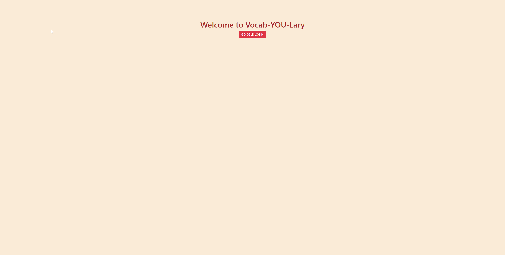
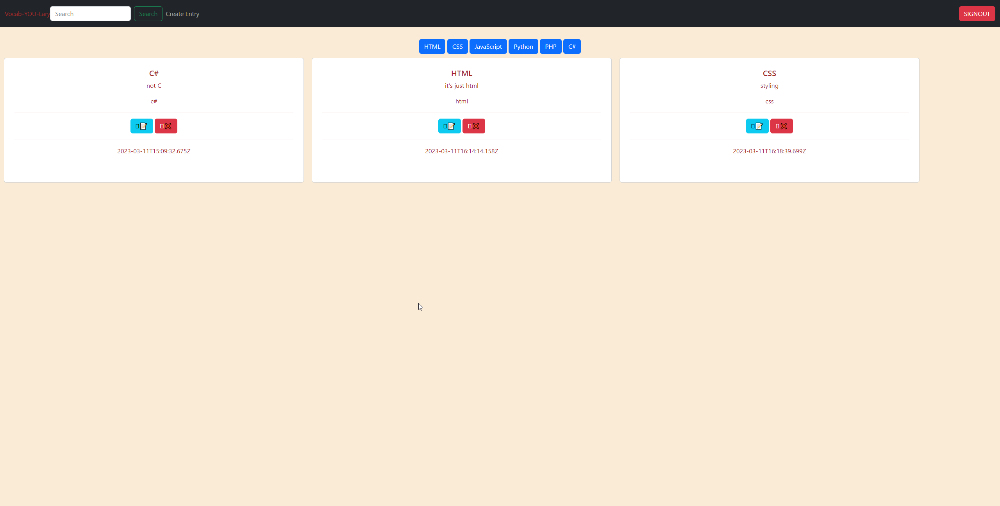
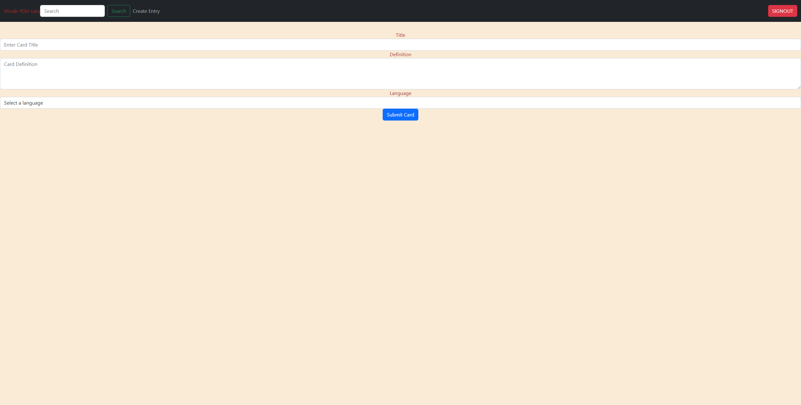

# Vocab-YOU-Lary

## Overview
Vocab-YOU-Lary is a web application that allows users to create a list of programming languages using their own account. The user can create a card with the language title and description, as well as edit and delete the cards. They can also filter their cards by language.

## Links
- [Deployed Project](https://bch-vocab-you-lary.netlify.app/)
- [Wireframes/Prototype](https://www.figma.com/file/gvL0wMCdfzemZfzfOmiDho/Individual-Assessment?node-id=0%3A1&t=AZeONVb1B0JrCnDf-0)
- [Data Flowchart](https://lucid.app/lucidchart/e1987c72-e480-40ae-8bf4-ed88e6629254/edit?beaconFlowId=B9EB6102278480FC&invitationId=inv_4f6fa176-14e4-4201-881f-1aa3d5464845&page=0_0#)
- [Project Board](https://github.com/users/bhighlander/projects/2/views/1)
- [Technical Flowchart](https://lucid.app/lucidchart/bf72b6b0-20bf-4fb2-8e92-876e1ffe6969/edit?beaconFlowId=7487451108BEE17F&invitationId=inv_33c7d1ad-0959-40cc-958b-c81809b1087b&page=0_0#)

## User and Problem
The target users for this project are new programmers who want a place to store information to better understand different types of programming languages.

## Features
- User login/authentication
- Create, read, update, and delete custom language cards
- Filter cards on their account by language

## Screenshots

## Contributors
- [Brandon Highland](https://github.com/bhighlander)

## Loom Video Walkthrough
[Loom Video](https://www.loom.com/share/a3d7f83ca86b42279ebe3d50f7d8605a)
